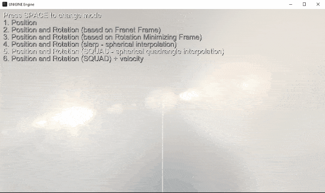
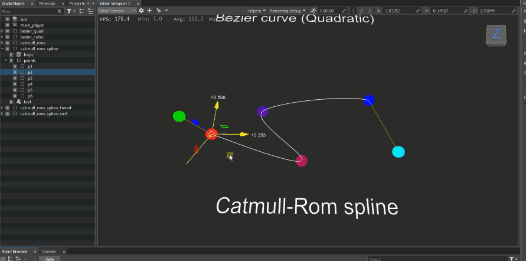
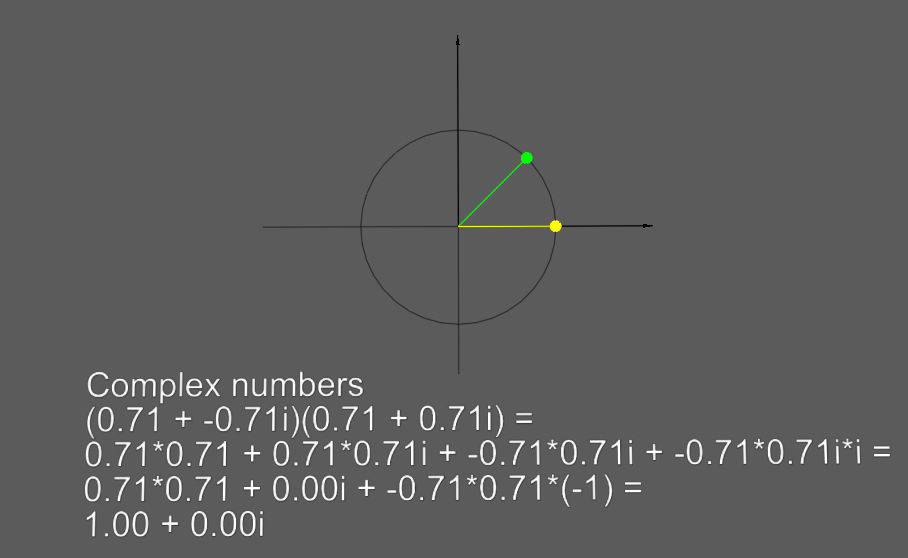

# Rollercoaster
# Приложение к докладу на [Gamedev Weekend 2022](https://gamedevweekend.ru)

 
Сцена: Rollercoaster.world
   

 
Сцена: SplineSamples.world
   

 
Сцена: ComplexNumbers.world
   

# Инструкция по запуску
1. Скачиваем и устанавливаем Unigine SDK Browser [вот отсюда](https://unigine.com/get-unigine/)
2. Устанавливаем Unigine SDK Community (2.15.1)
3. Создаем новый C++ проект со следующими параметрами:
- Project Name: Rollercoaster
- SDK: UNIGINE 2 Community (2.15.1)
- Engine: Development
- Template: Empty
- API + IDE: C++ (Visual Studio 2015+)
- Precision: Float
4. Копируем содержимое текущего git репозитория в созданный проект с заменой файлов
5. Открываем Rollercoaster.sln в Visual Studio 2015+, собираем и запускаем проект (F5)

# Полезные ссылки
1. [Ссылка на оригинальный доклад](https://docs.google.com/presentation/d/1OT9-H_ngJ3sWocX5bsWtAZzV5IbwHT8i6En10KadYQE/edit?usp=sharing)
2. [Ссылка на доклад про Easing Functions на Хабрахабре](https://habr.com/ru/company/unigine/blog/680996/)

